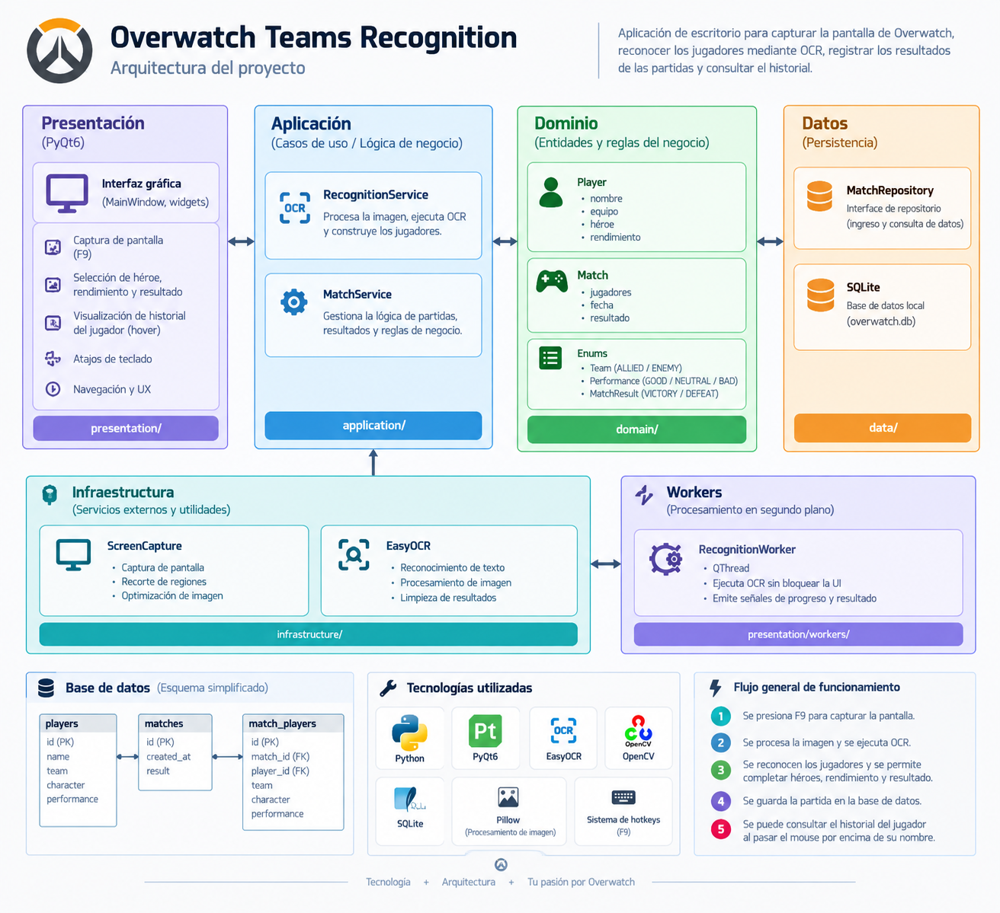

# Overwatch Teams Recognition

Desktop application for recognizing Overwatch teams
using OCR and storing match history.

## Features

- Capture the Overwatch scoreboard
- Recognize player names using OCR
- Identify allied and enemy teams
- Select the played character
- Register player performance
- Store match history
- View previous player matches

## Technologies

- Python
- PyQt6
- EasyOCR
- OpenCV
- SQLite

## Architecture

